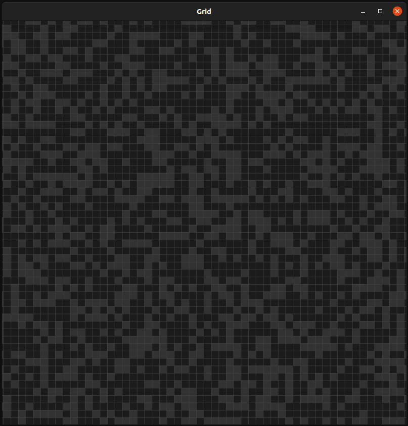

# Grid (Work in progress)

Improved version of [Pygrid](https://github.com/jake-stewart/pygrid), using C++ and SFML/OpenGL for improved performance.

## Major changes
The grid is stored as a texture in graphics memory, where each cell is a single pixel. When rendered, the texture is scaled by a factor to allow for zooming,
and only the rectangle of the grid that is in view is rendered, allowing for it to be panned around.

The texture is rendered with a shader, which is a mix between linear and nearest-neighbour interpolation. instead of antialiasing each pixel, it antialiases each cell, which is just a scaled pixel. The gridlines are also antialiased.

All of this together allows for smooth, fraction of a pixel zooming and panning, without choppiness or aliasing and remaining performant at thousands of frames per second.

## Todo
* deleteCell() method
* clearGrid() method
* Rendering text support?
* Python scripting

I think threading and saving/loading the grid will be up to the user to implement with python. seems out of scope. 

## Example

